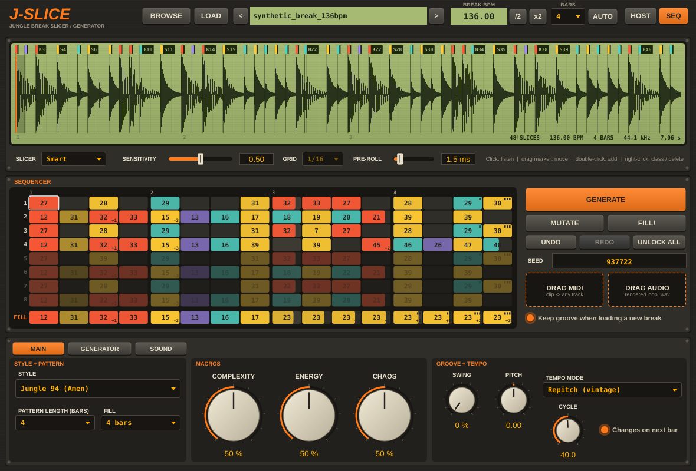

# J-Slice

**Slicer + générateur de rythmiques jungle / drum and bass** (VST3 pour Ableton Live et autres DAW, Windows).

Tu charges un break de batterie, J-Slice le découpe automatiquement aux bons endroits, reconnaît
les kicks / snares / hats / ghost notes, puis génère des séquences dans le style choisi (Jungle 94,
Ragga, Rinse-Out Choppage, Two-Step, Rollers, Liquid, Neurofunk, Halftime, Drumfunk, Breakcore),
synchronisées au tempo d'Ableton.



## Télécharger et installer

1. Ouvre la page **Releases** du dépôt → **latest** → télécharge `J-Slice-Windows.zip`
   (ou onglet **Actions** → dernier build → artifact `J-Slice-Windows`).
2. Dézippe et copie **tout le dossier** `J-Slice.vst3` dans `C:\Program Files\Common Files\VST3`.
3. Ableton Live 12 : *Settings → Plug-Ins* → active **Use VST3 Plug-In System Folders** → **Rescan**.
4. *Plug-Ins → Kozzzmo → J-Slice* : glisse-le sur une piste MIDI.

`J-Slice.exe` (dans le zip) est une version autonome pour tester sans Ableton.

## Prise en main en 30 secondes

1. **BROWSE** (ou glisser-déposer un fichier sur le plugin) → choisis un break. Avec
   *Load on click*, les flèches haut/bas du clavier chargent les fichiers un par un : idéal
   pour parcourir une collection de breaks. **+ FAV** mémorise un dossier dans tes favoris.
2. Vérifie le **BREAK BPM** et le nombre de **BARS** détectés (corrige avec /2, x2 ou en tapant
   la valeur ; **AUTO** revient à la détection).
3. Choisis un **STYLE** (onglet MAIN) : ça charge ses réglages et génère un pattern.
4. Lance la lecture dans Ableton (ou **PLAY** dans le plugin). **GENERATE** pour un nouveau
   pattern, **MUTATE** pour des variations, **FILL!** pour jouer le fill à la mesure suivante.

## L'interface

### Écran du break (LCD)
- Marqueurs colorés : **K** kick (rouge), **S** snare (jaune), **H** hat/cymbale (turquoise),
  **G** ghost note (violet).
- Clic : écouter une slice. Glisser un marqueur : le déplacer. Double-clic : ajouter un marqueur.
  Clic droit : changer la classe, revenir à la classe automatique, supprimer.
- **SLICER** : *Smart* (recommandé), *Transient*, *Grid*. **SENSITIVITY** : plus = plus de slices
  (ghosts, charleys), moins = seulement les frappes principales. **PRE-ROLL** : coupe un peu avant
  l'attaque pour garder le punch.

### Séquenceur (8 mesures + mesure de FILL)
- Clic : ajouter / effacer une frappe. Molette : changer de slice. Glisser haut/bas : vélocité.
- **Shift+clic** : verrouiller la case (contour orange) → elle est conservée quand tu régénères.
- **Alt+clic** : écouter. **Clic droit** : slice, reverse, roll (x2-x4), pitch, longueur, vélocité.
- Symboles : triangle = joué à l'envers, petits traits = roll, +n/-n = pitch, case plus courte =
  frappe raccourcie.
- **SEED** : même seed + mêmes réglages = même pattern. Tape un nombre + Entrée.
- **UNDO / REDO** (64 niveaux), **UNLOCK ALL**.
- **DRAG MIDI** : glisse le pattern en clip MIDI dans Ableton (C1 = slice 1, comme le mode
  Slice du Simpler). **DRAG AUDIO** : glisse la boucle rendue en WAV (avec pitch, reverse, rolls et
  effets).
- **Keep groove when loading a new break** : en changeant de break, le pattern est conservé et
  chaque frappe est remplacée par une frappe du même type dans le nouveau break.

### Onglet MAIN
- **STYLE** : charge les réglages du style et génère.
- **COMPLEXITY** (découpe, rolls, coupes en 1/16), **ENERGY** (densité, ghosts, hats),
  **CHAOS** (reverse, pitch, stutters, frappes raccourcies, variations). À 50 % = réglages du
  style ; 0 % = supprimé ; 100 % = doublé.
- **PATTERN LENGTH** 1/2/4/8 mesures, **FILL** toutes les 2/4/8 mesures (ou Off), **SWING**,
  **PITCH** global, **TEMPO MODE** :
  - *Repitch (vintage)* : le break est accéléré comme sur un sampler des années 90 (le pitch monte) ;
  - *Slice (original speed)* : chaque frappe garde sa hauteur, recalée sur la grille ;
  - *Cyclic stretch (Akai)* : time-stretch "métallique" façon Akai S950/S1000 (**CYCLE** = longueur
    du cycle).
- **Changes on next bar** : un nouveau pattern démarre proprement à la mesure suivante.

### Onglet GENERATOR (réglages fins, modulés par les 3 macros)
Density, Backbone (respect du squelette kick/snare du style), Ghosts, Hats, Chop (sauts dans le
break), 16th cuts, Repeats, Rolls, Stutter, Reverse, Pitch prob, Pitch range, Short hits,
Variation, Fill amount, Humanize.

### Onglet SOUND
- **Voices** Mono (une frappe coupe la précédente, son "haché" typique) ou Poly.
- **Slice tail** : *Chunk* (le break continue de jouer jusqu'à la frappe suivante, son jungle
  classique) ou *Hit* (chaque frappe s'arrête à la fin de sa slice, plus propre pour la DnB).
- **Attack**, **Tightness** (raccourcit les queues), **Velocity** (sensibilité).
- **Vintage sampler** (bits + fréquence d'échantillonnage, 12 bits / 26 kHz par défaut),
  **Filter** (LP/BP/HP résonant), **Drive**, **Output**. Chaque section a son bouton On.

## Contrôle MIDI et automation

| Note | Action |
|------|--------|
| C1 (36) et au-dessus | joue la slice 1, 2, 3… (vélocité respectée) |
| C0 (24) | GENERATE |
| C#0 (25) | MUTATE |
| D0 (26) | FILL à la mesure suivante |
| D#0 (27) | UNDO |
| E0 (28) | séquenceur on/off |

Tous les paramètres sont automatisables. *Trigger: generate / mutate / fill* sont des paramètres
"boutons" pour Push, un contrôleur MIDI ou une enveloppe de clip.

Astuce : **SEQ off** + un clip MIDI = tu joues toi-même les slices (par exemple le clip obtenu
avec DRAG MIDI, que tu peux ensuite éditer dans Ableton).

## Le break et le projet Ableton

Le fichier audio est **intégré dans le projet** (copie FLAC dans l'état du plugin) : si tu déplaces
ou supprimes le WAV, ou ouvres le projet sur un autre ordinateur, le break est toujours là.
Les dossiers favoris sont communs à toutes les instances.

## Comment ça marche

Voir [docs/RECHERCHE.md](docs/RECHERCHE.md) : la recherche sur la jungle / DnB (breaks, chopping,
samplers Akai, patterns two-step / halftime / neuro, algorithme de découpe de Nick Collins) et
comment chaque point a été traduit dans le plugin.

Organisation du code :

| Fichier | Rôle |
|---------|------|
| `Source/Core/Analyzer.*` | détection d'attaques multi-bandes, tempo, découpe Smart/Transient/Grid, classification |
| `Source/Core/Generator.*` | styles, génération (découpe Collins + squelette + gabarits + ornements), mutation, remap |
| `Source/Core/Engine.*` | lecteur temps réel : séquenceur synchronisé, voix (repitch / slice / cyclic), effets |
| `Source/Core/Exporter.h` | export MIDI et rendu audio |
| `Source/PluginProcessor.*` | paramètres, état, chargement, historique |
| `Source/PluginEditor.*`, `Source/UI/*` | interface |
| `Tests/TestMain.cpp` | tests automatiques (break synthétique, tempo, découpe, classes, génération, rendu) |
| `Tests/Harness.cpp` | test d'intégration du plugin complet + captures d'écran (Linux) |

## Compiler soi-même

Pré-requis : CMake ≥ 3.22, Visual Studio 2022 (Windows). JUCE 8 est téléchargé automatiquement.

```
cmake -B build -G "Visual Studio 17 2022" -A x64
cmake --build build --config Release --target JSlice_VST3
```

Chaque push sur `main` lance la compilation sur GitHub Actions et met à jour la release **latest**.

## Licence

J-Slice utilise le framework [JUCE](https://juce.com) (licence AGPLv3 ou licence commerciale JUCE ;
usage personnel gratuit). Si tu distribues le plugin, respecte les conditions de la licence JUCE.
